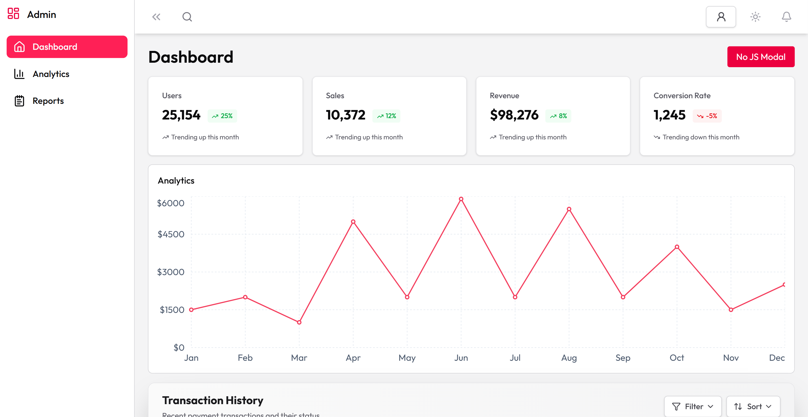
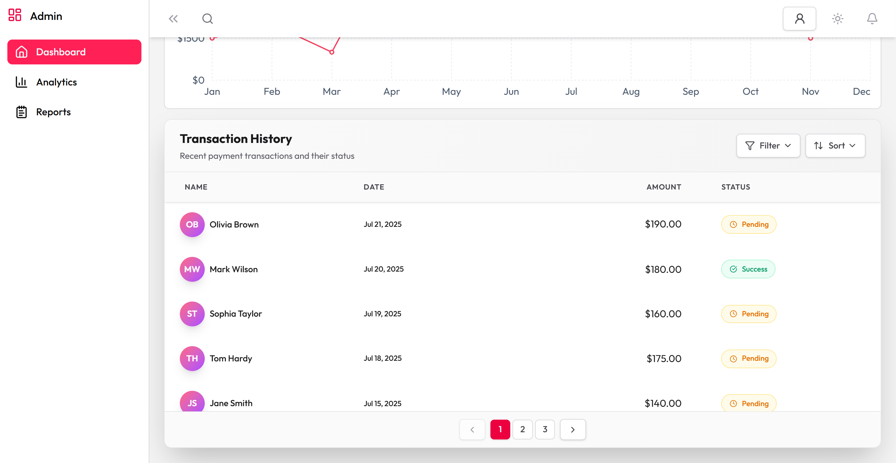
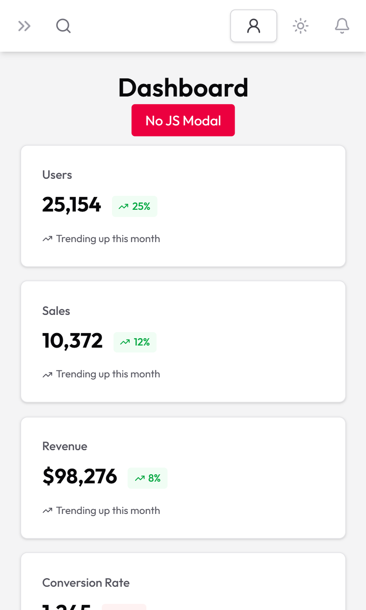
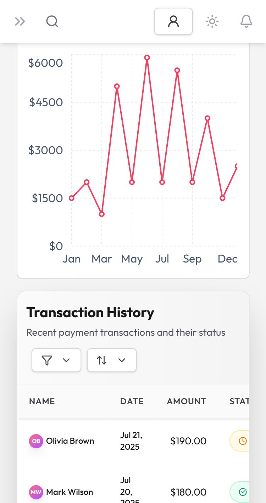
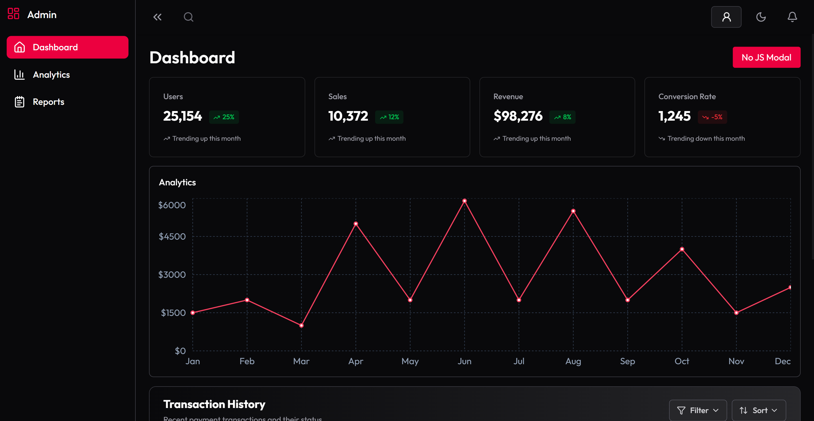
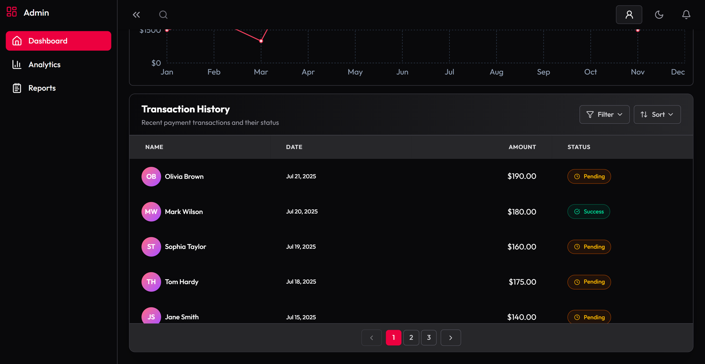

# Admin-Dashboard-UI

## Live-link - https://admin-dashboard-ui-kappa.vercel.app/

### Desktop Screen View



### Mobile Screen View



### Dark Mode 



## Installation

To get a local copy up and running, follow these steps:

1. **Clone the repository**

   ```sh
   git clone https://github.com/isayanpal/admin-dashboard-ui
   ```

2. **Navigate to the project directory**

   ```sh
   cd admin-dashboard-ui
   ```

3. **Install dependencies and start the frontend server**

   ```sh
   npm install
   npm run dev
   ```
